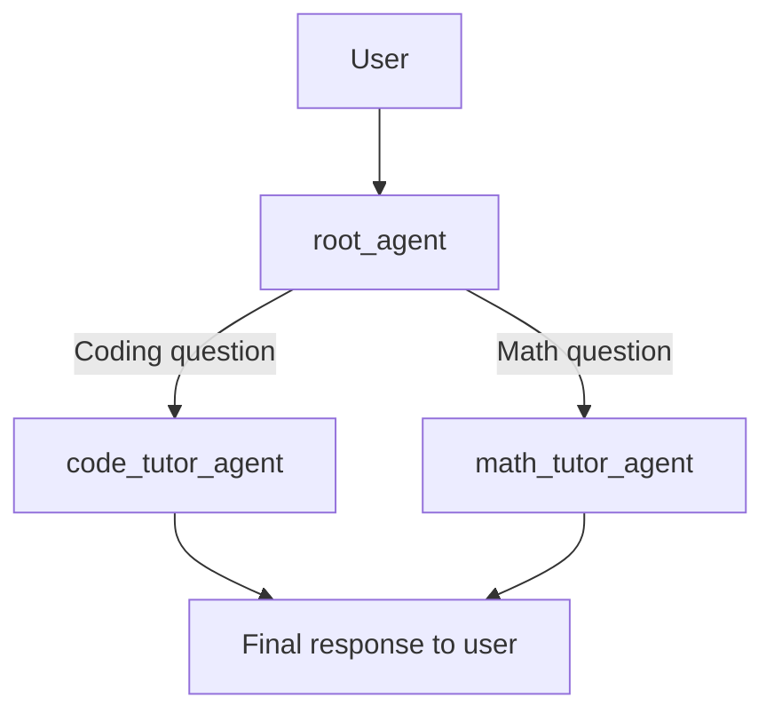
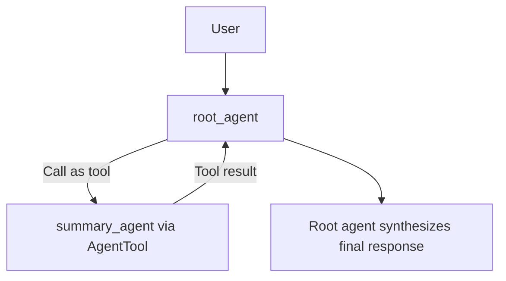

# Agent Config trong ADK

> Hub: [[Build Agents]]

## Tóm tắt

`Agent Config` là tính năng cho phép xây ADK agent bằng file YAML thay vì viết toàn bộ bằng Python/Java code.

Thay vì viết:

```python
from google.adk.agents import Agent

root_agent = Agent(
    name="assistant_agent",
    model="gemini-flash-latest",
    description="A helper agent.",
    instruction="You help answer user questions.",
)
```

Ta có thể viết `root_agent.yaml`:

```yaml
name: assistant_agent
model: gemini-flash-latest
description: A helper agent that can answer users' questions.
instruction: You are an agent to help answer users' various questions.
```

ADK sẽ đọc YAML này và tự khởi tạo agent tương ứng.

## Khi nào nên dùng Agent Config?

Nên dùng khi:

- Muốn cấu hình agent rõ ràng bằng YAML.
- Muốn tách root agent, sub-agent, tool và callback thành nhiều file dễ quản lý.
- Muốn chỉnh instruction/model/tool mà không sửa nhiều code.
- Muốn version control agent definition giống một cấu hình hệ thống.
- Muốn người ít code vẫn đọc và chỉnh được agent.

Không nên kỳ vọng Agent Config thay thế hoàn toàn code. Nếu tool có logic thật, ví dụ gọi database, API nội bộ, hoặc xử lý nghiệp vụ, vẫn cần viết Python/Java rồi reference vào YAML.

## Cách tạo project Agent Config

Theo ADK docs, dùng lệnh:

```bash
adk create --type=config my_agent
```

Lệnh này tạo folder:

```text
my_agent/
  root_agent.yaml
  .env
```

Trong `.env`, nếu dùng Gemini API qua Google AI Studio:

```env
GOOGLE_GENAI_USE_VERTEXAI=0
GOOGLE_API_KEY=...
```

Nếu dùng Vertex AI:

```env
GOOGLE_GENAI_USE_VERTEXAI=1
GOOGLE_CLOUD_PROJECT=...
GOOGLE_CLOUD_LOCATION=us-central1
```

Chạy agent:

```bash
adk web
```

Hoặc:

```bash
adk run
adk api_server
```

## Cấu trúc YAML cơ bản

Ví dụ tối giản:

```yaml
agent_class: LlmAgent
name: root_agent
model: gemini-flash-latest
description: Agent chính trả lời câu hỏi của user.
instruction: |
  Bạn là agent chính.
  Trả lời ngắn gọn, rõ ràng, đúng trọng tâm.
```

Các field quan trọng:

- `agent_class`: loại agent. Mặc định thường là `LlmAgent`.
- `name`: tên agent, bắt buộc.
- `model`: model dùng cho agent.
- `description`: mô tả agent, quan trọng cho routing/delegation.
- `instruction`: system instruction cho agent, bắt buộc với `LlmAgent`.
- `tools`: danh sách tool agent được phép gọi.
- `sub_agents`: danh sách agent con để delegate.
- `before_model_callbacks`, `before_tool_callbacks`: guardrails.
- `output_key`: lưu final output vào session state.
- `generate_content_config`: cấu hình thêm cho model generation.

## Built-in tool bằng YAML

Ví dụ agent có Google Search:

```yaml
name: search_agent
model: gemini-flash-latest
description: Agent dùng Google Search để trả lời câu hỏi.
instruction: |
  Bạn là agent có nhiệm vụ tìm kiếm Google và trả lời dựa trên kết quả.
tools:
  - name: google_search
```

Ở đây `google_search` là built-in tool trong ADK.

## Custom tool bằng YAML

Nếu có file Python:

```python
# my_tools.py
def check_prime(numbers: list[int]) -> dict:
    """Check whether each number is prime."""
    ...
```

YAML reference tool bằng fully-qualified name:

```yaml
agent_class: LlmAgent
name: prime_agent
model: gemini-flash-latest
description: Kiểm tra số nguyên tố.
instruction: |
  Khi user hỏi kiểm tra số nguyên tố, hãy gọi check_prime.
  Không tự tính thủ công.
tools:
  - name: my_tools.check_prime
```

Điểm chính: YAML chỉ khai báo agent dùng tool nào. Logic thật của tool vẫn nằm trong code.

## Agent Team bằng YAML

Đây là pattern `sub_agents`, tức là root agent có thể delegate quyền trả lời cho agent con.

`root_agent.yaml`:

```yaml
agent_class: LlmAgent
name: root_agent
model: gemini-flash-latest
description: Learning assistant điều phối coding và math.
instruction: |
  Bạn là learning assistant.
  Nếu user hỏi coding, delegate cho code_tutor_agent.
  Nếu user hỏi toán, delegate cho math_tutor_agent.
sub_agents:
  - config_path: code_tutor_agent.yaml
  - config_path: math_tutor_agent.yaml
```

`code_tutor_agent.yaml`:

```yaml
agent_class: LlmAgent
name: code_tutor_agent
model: gemini-flash-latest
description: Agent chuyên giải thích lập trình.
instruction: |
  Bạn chỉ xử lý câu hỏi về lập trình.
```

`math_tutor_agent.yaml`:

```yaml
agent_class: LlmAgent
name: math_tutor_agent
model: gemini-flash-latest
description: Agent chuyên giải thích toán học.
instruction: |
  Bạn chỉ xử lý câu hỏi về toán.
```

Luồng:



Ở pattern này, khi delegate xảy ra, sub-agent là agent tạo final response cho user trong lượt đó.

## AgentTool bằng YAML

Nếu muốn root agent gọi agent khác như một tool, nhận kết quả rồi tự tổng hợp, dùng `AgentTool` trong `tools`, không dùng `sub_agents`.

`root_agent.yaml`:

```yaml
agent_class: LlmAgent
name: root_agent
model: gemini-flash-latest
description: Agent chính gọi summary_agent như tool rồi tổng hợp.
instruction: |
  Khi user đưa văn bản dài, gọi summary_agent như một tool.
  Sau khi nhận kết quả, tự viết câu trả lời cuối cùng cho user.
tools:
  - name: AgentTool
    args:
      agent: ./summary_agent.yaml
      skip_summarization: true
```

`summary_agent.yaml`:

```yaml
agent_class: LlmAgent
name: summary_agent
model: gemini-flash-latest
description: Agent chuyên tóm tắt văn bản.
instruction: |
  Bạn là expert summarizer.
  Hãy tóm tắt văn bản được đưa vào một cách ngắn gọn, có cấu trúc.
```

Luồng:



So sánh nhanh:

| Pattern | Root agent làm gì? | Agent con làm gì? | Ai tạo final response? |
|---|---|---|---|
| `sub_agents` | Route/delegate | Nhận quyền xử lý | Sub-agent |
| `AgentTool` | Gọi agent khác như tool | Trả kết quả về root | Root agent |

## Callbacks bằng YAML

Agent Config hỗ trợ khai báo callbacks:

```yaml
before_model_callbacks:
  - name: my_library.callbacks.before_model_callback

before_tool_callbacks:
  - name: my_library.callbacks.before_tool_callback
```

Các callback thường dùng:

- `before_agent_callbacks`: chạy trước khi agent bắt đầu xử lý.
- `after_agent_callbacks`: chạy sau khi agent xử lý.
- `before_model_callbacks`: chạy trước khi request vào LLM.
- `after_model_callbacks`: chạy sau khi model trả output.
- `before_tool_callbacks`: chạy trước khi tool thật sự chạy.
- `after_tool_callbacks`: chạy sau khi tool chạy xong.

Ứng dụng:

- Chặn input vi phạm policy.
- Kiểm tra tham số tool.
- Ghi log.
- Thêm context động.
- Chặn tool call nguy hiểm.

## Workflow agents trong config

Agent Config syntax hỗ trợ nhiều agent class:

- `LlmAgent`: agent dùng LLM, instruction, tools.
- `SequentialAgent`: chạy sub-agents theo thứ tự.
- `ParallelAgent`: chạy sub-agents song song.
- `LoopAgent`: chạy lặp với `max_iterations`.

Ví dụ `SequentialAgent`:

```yaml
agent_class: SequentialAgent
name: research_then_write
description: Chạy research agent rồi write agent.
sub_agents:
  - config_path: research_agent.yaml
  - config_path: writer_agent.yaml
```

Ví dụ `LoopAgent`:

```yaml
agent_class: LoopAgent
name: revise_loop
description: Lặp qua reviewer và writer.
max_iterations: 3
sub_agents:
  - config_path: reviewer_agent.yaml
  - config_path: writer_agent.yaml
```

## Chạy programmatically

Có thể load YAML trực tiếp trong code:

```python
import asyncio
from google.adk.agents import config_agent_utils

async def main():
    agent = config_agent_utils.from_config("my_agent/root_agent.yaml")
    # tạo Runner và chạy như agent bình thường

if __name__ == "__main__":
    asyncio.run(main())
```

Khi đó YAML chỉ là nguồn cấu hình; trong runtime, ADK vẫn tạo ra agent object thật.

## Giới hạn hiện tại

Agent Config đang ở trạng thái experimental.

Một số giới hạn quan trọng:

- Hiện chủ yếu hỗ trợ Gemini models.
- Tool custom vẫn cần Python hoặc Java code.
- Không phải mọi ADK tool đều được hỗ trợ đầy đủ.
- `LangGraphAgent` và `A2aAgent` chưa được hỗ trợ.
- Một số tool được hỗ trợ gồm `google_search`, `AgentTool`, `LongRunningFunctionTool`, `load_web_page`, `url_context`, `load_artifacts`, v.v.

## Ghi nhớ

Agent Config trả lời câu hỏi: "Làm sao khai báo agent bằng YAML thay vì code?"

`sub_agents` trả lời câu hỏi: "Root agent delegate cho agent nào xử lý?"

`AgentTool` trả lời câu hỏi: "Root agent gọi agent khác như tool rồi tự tổng hợp thế nào?"

Trong thực tế, cách tổ chức thường tốt là:

```text
my_agent/
  .env
  root_agent.yaml
  summary_agent.yaml
  research_agent.yaml
  tools.py
  callbacks.py
```

YAML giữ phần cấu hình agent dễ đọc. Python giữ phần logic thật.

## Nguồn

- [Build agents with Agent Config](https://adk.dev/agents/config/)
- [Agent Config syntax reference](https://adk.dev/api-reference/agentconfig/)
