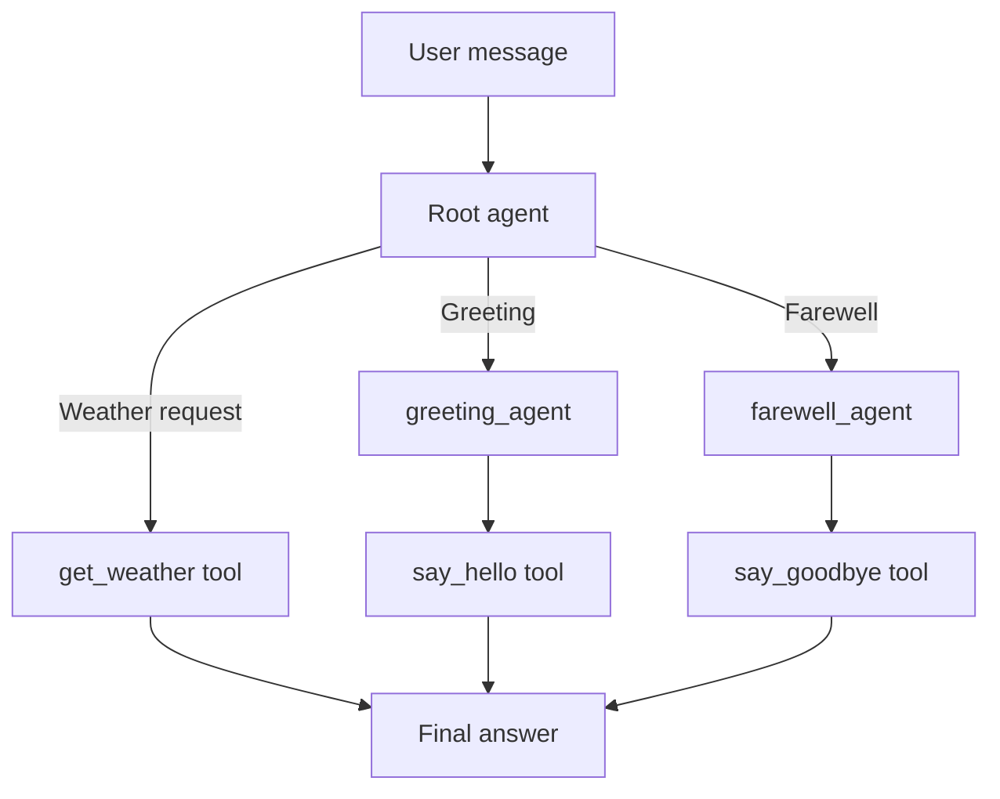
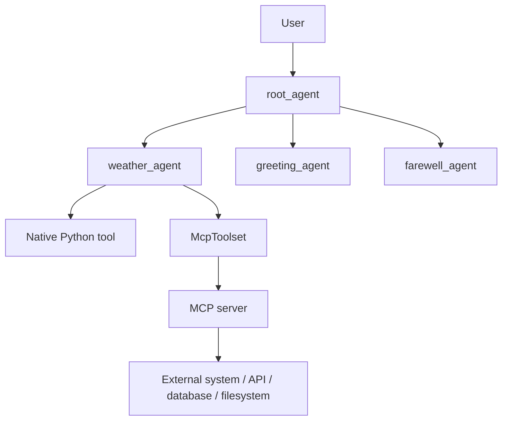

# Agent Team và MCP trong ADK

## Tóm tắt

`Agent Team` trong ADK là cách xây một hệ thống gồm nhiều AI agent phối hợp với nhau. Thay vì nhồi tất cả logic vào một agent duy nhất, ta chia thành:

- `root_agent`: agent chính, nhận request từ user và điều phối.
- `sub_agents`: các agent con chuyên một nhiệm vụ hẹp.
- `tools`: các hàm/capability mà agent có thể gọi để làm việc thật.
- `session state`: bộ nhớ theo phiên hội thoại.
- `callbacks`: hook để kiểm soát hành vi trước/sau khi gọi model hoặc tool.

Tutorial [Agent team](https://adk.dev/tutorials/agent-team/) dùng ví dụ Weather Bot để dạy các khái niệm này theo từng bước: từ một agent hỏi thời tiết, nâng cấp sang nhiều model, thêm sub-agent, thêm state, và thêm guardrails.

## ADK là gì trong ngữ cảnh này?

ADK, hay Agent Development Kit, là framework để xây ứng dụng dựa trên LLM. Trong tutorial này, ADK cung cấp các thành phần chính:

- `Agent`: bộ não AI, có instruction, model, tool và description.
- `Runner`: engine chạy vòng đời agent, nhận message, gọi model/tool, trả event.
- `SessionService`: quản lý lịch sử hội thoại và state.
- `ToolContext`: cho tool đọc/ghi session state.
- `Callback`: kiểm tra, sửa, hoặc chặn request/tool call.

## Agent Team là gì?

Agent Team là pattern trong đó một agent chính điều phối nhiều agent con.

Ví dụ trong tutorial:

- `weather_agent_v2`: root agent, xử lý câu hỏi về thời tiết.
- `greeting_agent`: sub-agent chỉ xử lý lời chào.
- `farewell_agent`: sub-agent chỉ xử lý lời tạm biệt.
- `get_weather`: tool lấy dữ liệu thời tiết.
- `say_hello`, `say_goodbye`: tool cho các sub-agent.

Root agent dựa vào `description` của sub-agent và instruction của chính nó để quyết định có delegate hay không.



## Các bước chính trong tutorial

### 1. Tạo agent đơn giản

Bắt đầu với một tool Python:

```python
def get_weather(city: str) -> dict:
    """Retrieves the current weather report for a specified city."""
    ...
```

Sau đó gắn tool vào agent:

```python
weather_agent = Agent(
    name="weather_agent_v1",
    model="gemini-flash-latest",
    description="Provides weather information for specific cities.",
    instruction="Use get_weather when user asks about weather.",
    tools=[get_weather],
)
```

Điểm quan trọng: docstring của tool phải rõ, vì LLM dựa vào đó để hiểu tool làm gì, khi nào gọi, và cần tham số nào.

### 2. Dùng nhiều model

ADK có thể dùng Gemini trực tiếp, hoặc dùng GPT/Claude qua LiteLLM:

```python
from google.adk.models.lite_llm import LiteLlm

agent = Agent(
    model=LiteLlm(model="openai/gpt-4.1"),
    ...
)
```

Lý do dùng nhiều model:

- Chọn model rẻ hơn cho task đơn giản.
- Chọn model mạnh hơn cho task điều phối/phức tạp.
- Dự phòng khi một provider gặp lỗi.

### 3. Tạo sub-agent và delegation

Sub-agent nên có scope hẹp:

```python
greeting_agent = Agent(
    name="greeting_agent",
    description="Handles simple greetings and hellos.",
    instruction="Your ONLY task is to greet the user.",
    tools=[say_hello],
)
```

Root agent thêm `sub_agents`:

```python
root_agent = Agent(
    name="weather_agent_v2",
    description="Main coordinator agent.",
    instruction="Handle weather yourself. Delegate greetings and farewells.",
    tools=[get_weather],
    sub_agents=[greeting_agent, farewell_agent],
)
```

`description` của sub-agent rất quan trọng vì root agent dùng nó để quyết định route.

### 4. Thêm memory bằng Session State

Session state là dictionary gắn với một user/session. Tool có thể đọc/ghi state bằng `ToolContext`.

Ví dụ:

```python
def get_weather_stateful(city: str, tool_context: ToolContext) -> dict:
    preferred_unit = tool_context.state.get(
        "user_preference_temperature_unit",
        "Celsius",
    )
    tool_context.state["last_city_checked_stateful"] = city
    ...
```

Ứng dụng:

- Nhớ đơn vị nhiệt độ user thích.
- Nhớ thành phố vừa hỏi.
- Nhớ câu trả lời cuối cùng bằng `output_key`.

### 5. Thêm input guardrail bằng `before_model_callback`

`before_model_callback` chạy trước khi request được gửi vào LLM.

Dùng để:

- Chặn keyword/câu hỏi không hợp lệ.
- Thêm context động vào prompt.
- Ghi log hoặc đánh dấu state.

Nếu callback return `LlmResponse`, ADK bỏ qua model call và trả về response đó luôn.

### 6. Thêm tool guardrail bằng `before_tool_callback`

`before_tool_callback` chạy sau khi LLM quyết định gọi tool, nhưng trước khi tool thật sự chạy.

Dùng để:

- Kiểm tra tham số tool.
- Chặn tool call nguy hiểm.
- Sửa tham số trước khi tool chạy.

Ví dụ tutorial chặn weather request cho `Paris`. Callback trả về dict lỗi, nên tool gốc không chạy.

## MCP là gì?

MCP, hay Model Context Protocol, là chuẩn kết nối giữa LLM/agent với ứng dụng, data source và tools bên ngoài.

Theo ADK docs, MCP dùng kiến trúc client-server:

- MCP server expose `resources`, `prompts`, và `tools`.
- MCP client tiêu thụ các capability đó.
- ADK agent có thể đóng vai MCP client.

Trong ADK, cầu nối chính là `McpToolset`.

`McpToolset` làm các việc:

- Kết nối MCP server local hoặc remote.
- Gọi `list_tools` để discover tool.
- Chuyển schema MCP tool thành ADK-compatible `BaseTool`.
- Cho agent thấy MCP tools như native ADK tools.
- Proxy tool call từ agent sang MCP server bằng `call_tool`.
- Có thể dùng `tool_filter` để chỉ expose một số tool cần thiết.

## MCP gắn vào Agent Team như thế nào?

Agent Team và MCP không thay thế nhau. Chúng nằm ở hai lớp khác nhau:

- Agent Team: điều phối logic nội bộ giữa các agent.
- MCP: kết nối agent với tool/data/system bên ngoài.

Kiến trúc kết hợp:



Ví dụ thực tế:

- Trong tutorial, `get_weather` là mock Python function.
- Khi làm thật, có thể thay `get_weather` bằng MCP tool của Google Maps Grounding Lite để trả weather/places/routes.
- Hoặc tạo MCP server nội bộ để expose database, CRM, filesystem, internal API.

## Khi nào nên dùng Agent Team?

Nên dùng khi:

- Ứng dụng có nhiều loại intent khác nhau.
- Mỗi task cần instruction/model/tool riêng.
- Muốn thêm tính năng mới mà không làm root agent quá phức tạp.
- Cần kiểm soát delegation, state, guardrail rõ ràng.

Không nên tách quá sớm khi:

- Task chỉ có một workflow rất đơn giản.
- Mỗi sub-agent chỉ khác nhau rất nhỏ.
- Chỉ cần một agent với vài tools là đủ.

## Khi nào nên dùng MCP?

Nên dùng MCP khi:

- Tool/data nằm ngoài process của ADK.
- Muốn dùng lại tool cho nhiều client khác nhau, không chỉ ADK.
- Cần kết nối với service đã có MCP server.
- Muốn expose internal tools theo chuẩn chung.

Cần cân nhắc:

- MCP có connection lifecycle riêng.
- Local stdio MCP server phù hợp dev hoặc single-tenant.
- Remote HTTP/SSE MCP server phù hợp production hơn.
- Nên dùng `tool_filter` để giới hạn tool expose cho agent.

## Checklist triển khai nhanh

- Xác định root agent và scope của nó.
- Liệt kê các intent cần sub-agent riêng.
- Viết `description` của sub-agent thật rõ.
- Viết tool docstring rõ ràng.
- Chọn model theo task, không mặc định tất cả đều dùng model mạnh nhất.
- Dùng session state cho thông tin cần nhớ trong hội thoại.
- Thêm `before_model_callback` cho input policy.
- Thêm `before_tool_callback` cho tool argument policy.
- Nếu cần tool/data bên ngoài, thêm `McpToolset`.
- Khi dùng MCP production, cấu hình timeout, auth, logging, và `tool_filter`.

## Ghi nhớ

Agent Team trả lời câu hỏi: "Ai nên xử lý request này?"

MCP trả lời câu hỏi: "Agent có thể gọi tool/data bên ngoài bằng cách nào?"

Kết hợp hai thứ này sẽ tạo thành ứng dụng agentic có cấu trúc tốt: root agent điều phối, sub-agent chuyên môn hóa, và MCP tools mở rộng khả năng làm việc với hệ thống thực.

## Nguồn

- [Build Your First Intelligent Agent Team: A Progressive Weather Bot with ADK](https://adk.dev/tutorials/agent-team/)
- [Model Context Protocol in ADK](https://adk.dev/mcp/)
- [Model Context Protocol Tools](https://adk.dev/tools-custom/mcp-tools/)
