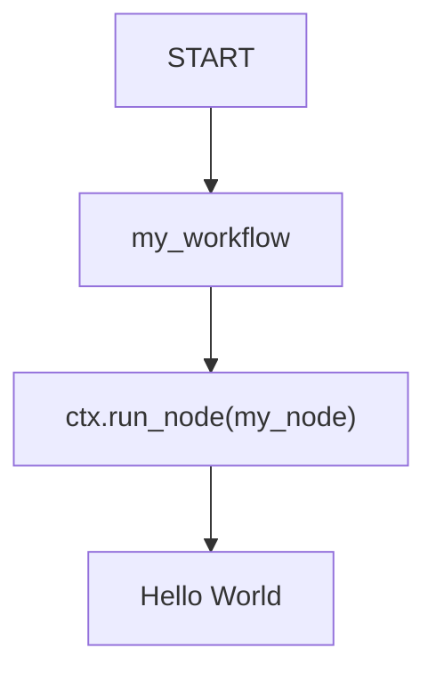
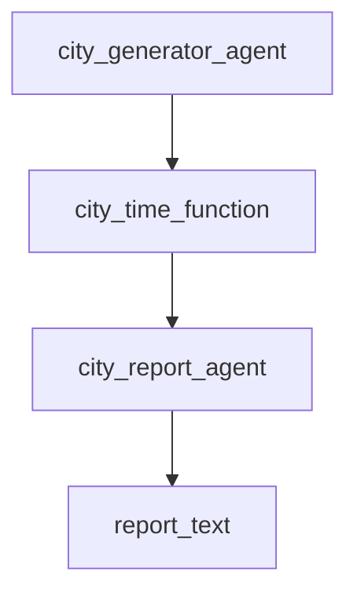
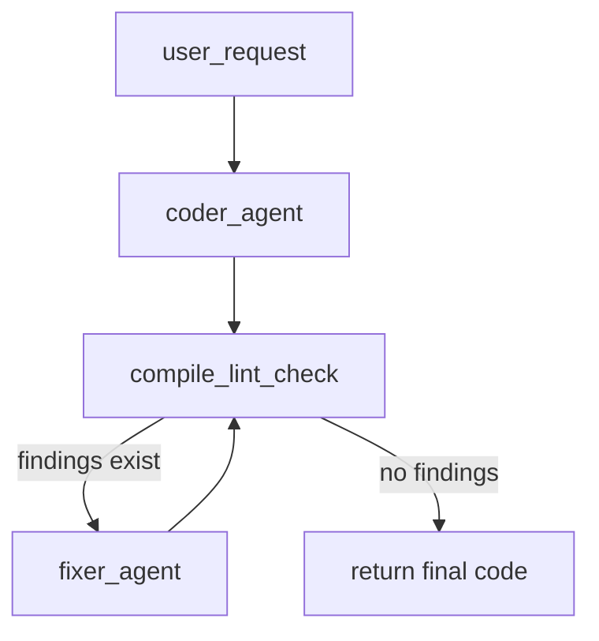
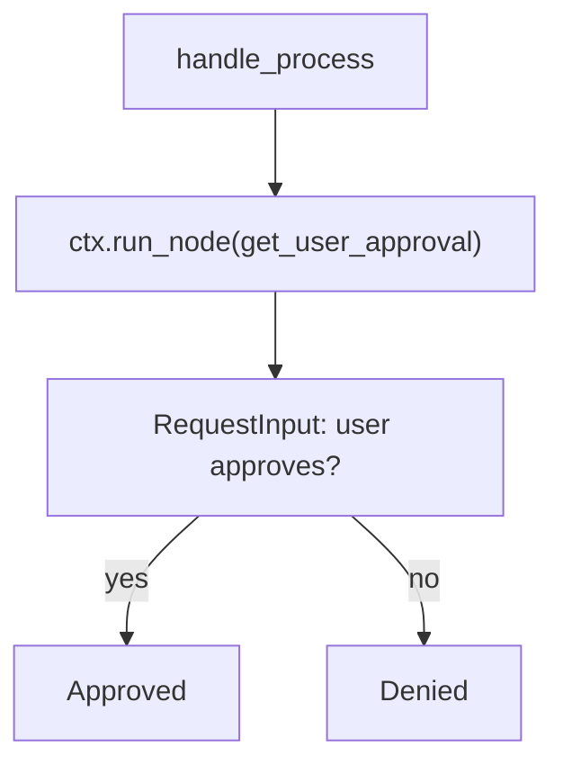

# Dynamic Workflows trong ADK

## Tóm tắt

`Dynamic Workflow` là cách xây workflow trong ADK bằng code Python thay vì khai báo toàn bộ luồng bằng graph `edges`.

Nếu [[Graph Routes trong ADK]] dùng:

```python
edges=[
    ("START", node_A, router),
    (router, {"BUG": node_B, "SUPPORT": node_C}),
]
```

thì `Dynamic Workflow` dùng Python control flow:

```python
if condition:
    ...
while not done:
    ...
await asyncio.gather(...)
```

Hiểu ngắn gọn:

```text
Graph Routes = khai báo flow bằng edges
Dynamic Workflow = viết flow bằng Python code
```

## Vì sao cần Dynamic Workflow?

Graph workflow rất tốt khi flow tương đối rõ:

```text
START -> A -> router -> B hoặc C
```

Nhưng khi workflow có logic phức tạp, graph static dễ trở nên rối:

- lặp cho tới khi pass review;
- số nhánh thay đổi theo input;
- chạy task theo danh sách động;
- recursion;
- parallel theo số lượng input không biết trước;
- human input rồi resume;
- branching nhiều tầng.

Dynamic workflow cho phép dùng toàn bộ sức mạnh của Python:

```text
if / else
while loop
for loop
async / await
asyncio.gather
recursion
```

## Ví dụ tối giản

```python
from google.adk import Context
from google.adk import Workflow
from google.adk.workflow import node
from typing import Any

@node(name="hello_node")
def my_node(node_input: Any):
    return "Hello World"

@node(rerun_on_resume=True)
async def my_workflow(ctx: Context, node_input: str) -> str:
    result = await ctx.run_node(my_node, node_input="hello")
    return result

root_agent = Workflow(
    name="root_agent",
    edges=[("START", my_workflow)],
)
```

Luồng:



Hai khái niệm quan trọng:

- `@node`: biến function thành workflow node.
- `ctx.run_node(...)`: chạy node con và lấy output.

## @node là gì?

`@node` là decorator giúp biến function bình thường thành node chạy được trong ADK workflow.

Ví dụ:

```python
from google.adk.workflow import node
from typing import Any

@node(name="hello_node")
def my_function_node(node_input: Any):
    return "Hello World"
```

Nói đơn giản:

```text
@node = wrapper để function của bạn trở thành workflow node
```

Nếu không dùng `@node`, bạn có thể phải tự tạo `FunctionNode`:

```python
success_node = FunctionNode(
    my_function_node,
    name="hello",
    rerun_on_resume=True,
)
```

Tự tạo wrapper hữu ích khi:

- wrap function từ external library;
- muốn tạo nhiều node từ cùng một function với config khác nhau;
- muốn quản lý node references trong registry riêng.

## ctx.run_node là gì?

`ctx.run_node()` dùng để gọi một node khác bên trong dynamic workflow.

Ví dụ:

```python
result = await ctx.run_node(my_node, node_input="hello")
```

Ý nghĩa:

```text
Chạy node my_node với input "hello"
Đợi node chạy xong
Lấy output trả về
```

Ví dụ sequence:

```python
@node(rerun_on_resume=True)
async def editorial_workflow(ctx: Context, user_request: str):
    raw_draft = await ctx.run_node(draft_agent, user_request)
    formatted_text = await ctx.run_node(format_function_node, raw_draft)
    return formatted_text
```

Luồng:

```text
user_request
-> draft_agent tạo draft
-> format_function_node format draft
-> return formatted_text
```

Khác với graph static, dữ liệu trả về trực tiếp từ `ctx.run_node()`, nên không cần tự handle `Event.output` nhiều như graph route.

## Data handling trong Dynamic Workflow

Trong [[Graph Data Handling trong ADK]], dữ liệu thường được truyền qua:

```python
Event(output=...)
```

Trong dynamic workflow, dữ liệu thường đi qua return value:

```python
result = await ctx.run_node(some_node, input_data)
```

Ví dụ:

```python
from google.adk import Context
from google.adk.workflow import node

@node(rerun_on_resume=True)
async def editorial_workflow(ctx: Context, user_request: str):
    raw_draft = await ctx.run_node(draft_agent, user_request)
    formatted_text = await ctx.run_node(format_function_node, raw_draft)
    return formatted_text
```

Có thể vẫn dùng schemas như graph workflow.

Ví dụ:

```python
from pydantic import BaseModel

class CityTime(BaseModel):
    time_info: str
    city: str

@node
def city_time_function(city: str):
    return CityTime(time_info="10:10 AM", city=city)

city_report_agent = Agent(
    name="city_report_agent",
    model="gemini-flash-latest",
    input_schema=CityTime,
    instruction="output the data provided by the previous node.",
)

@node
async def city_workflow(ctx: Context):
    city_time = await ctx.run_node(city_time_function, "Paris")
    report_text = await ctx.run_node(city_report_agent, city_time)
    return report_text
```

## Sequence route

Dynamic workflow vẫn chạy tuần tự được như graph workflow.

```python
@node
async def city_workflow(ctx: Context):
    city = await ctx.run_node(city_generator_agent)
    city_time = await ctx.run_node(city_time_function, city)
    report_text = await ctx.run_node(city_report_agent, city_time)
    return report_text
```

Luồng:



## Loop route

Loop là điểm mạnh của dynamic workflow.

Ví dụ workflow sinh code, lint, sửa cho tới khi không còn lỗi:

```python
from google.adk import Context
from google.adk import Event
from google.adk.agents import LlmAgent
from google.adk.workflow import node

coder_agent = LlmAgent(
    name="generator_agent",
    model="gemini-flash-latest",
    instruction="Write python code for user request.",
    output_schema=str,
)

@node(name="lint_reviewer")
async def compile_lint_check(ctx: Context, code: str):
    # Simulate API call or lint check
    class Response:
        findings = ""
    return Response()

fixer_agent = LlmAgent(
    name="fixer_agent",
    model="gemini-flash-latest",
    instruction="""Refactor current code {code}.
    Based on compile & lint review: {findings}""",
    output_schema=str,
)

@node
async def code_workflow(ctx: Context, user_request: str):
    code = await ctx.run_node(coder_agent, user_request)
    check_resp = await ctx.run_node(compile_lint_check, code)

    while check_resp.findings:
        yield Event(
            state={
                "code": code,
                "findings": check_resp.findings,
            }
        )

        code = await ctx.run_node(
            fixer_agent,
            {
                "code": code,
                "findings": check_resp.findings,
            },
        )

        check_resp = await ctx.run_node(compile_lint_check, code)

    return code
```

Luồng:



Workflow này khó biểu diễn gọn bằng static graph vì số vòng lặp không biết trước.

## Parallel execution

Dynamic workflow có thể dùng `asyncio.gather` để chạy song song.

Ví dụ chạy một worker node cho từng item:

```python
import asyncio
from typing import Any
from google.adk import Context
from google.adk.workflow import BaseNode, node

@node(rerun_on_resume=True)
async def parallel_supervisor(
    ctx: Context,
    node_input: list[Any],
    real_node: BaseNode,
):
    tasks = []

    for item in node_input:
        tasks.append(ctx.run_node(real_node, item))

    results = await asyncio.gather(*tasks)
    return results
```

Luồng:

```text
input list: [a, b, c]

run real_node(a)
run real_node(b)
run real_node(c)

gather results -> [result_a, result_b, result_c]
```

Dùng khi số lượng task parallel phụ thuộc vào input.

## Human input trong Dynamic Workflow

Dynamic workflow cũng hỗ trợ `RequestInput`, giống [[Human Input trong Graph Workflow ADK]].

Ví dụ:

```python
from typing import Any
from google.adk import Context
from google.adk.events import RequestInput
from google.adk.workflow import node

@node(rerun_on_resume=False)
async def get_user_approval(ctx: Context, node_input: Any):
    yield RequestInput(message="Please approve this request (Yes/No)")

@node(rerun_on_resume=True)
async def handle_process(ctx: Context, node_input: Any):
    user_response = await ctx.run_node(get_user_approval)

    if user_response.lower() == "yes":
        return "Approved"

    return "Denied"
```

Luồng:



Điểm quan trọng từ docs:

```text
Parent nodes dùng ctx.run_node phải set rerun_on_resume=True để handle interruptions properly.
```

## rerun_on_resume là gì?

`rerun_on_resume` là flag kiểm soát hành vi khi workflow resume sau khi bị pause/interrupted.

Ví dụ:

```python
@node(rerun_on_resume=True)
async def handle_process(ctx: Context, node_input: Any):
    user_response = await ctx.run_node(get_user_approval)
    ...
```

Ý nghĩa:

```text
Khi workflow resume, parent node có được chạy lại để tái tạo flow không?
```

Trong dynamic workflow, parent orchestrator thường nên dùng:

```python
rerun_on_resume=True
```

Node trực tiếp hỏi user có thể dùng:

```python
rerun_on_resume=False
```

để tránh hỏi lại khi resume.

## Automatic checkpointing

Dynamic workflow có automatic checkpointing.

Nghĩa là ADK theo dõi từng node execution.

Khi workflow resume:

```text
Node đã chạy thành công -> có thể được skip
Node fail/interrupted -> chạy lại
Workflow tiếp tục đúng thứ tự
```

Ví dụ:

```text
Step 1 done
Step 2 done
Step 3 pause chờ human input

Resume:
Step 1 và Step 2 không cần chạy lại
Workflow tiếp tục từ điểm cần resume
```

Đây là lý do dùng `ctx.run_node()` thay vì gọi function thường. `ctx.run_node()` giúp ADK tracking node execution để checkpoint/resume.

## Execution IDs

ADK tạo execution ID deterministic cho child node execution.

Các ID này dùng để:

- nhận diện node execution đã chạy;
- skip node đã thành công khi resume;
- chạy lại đúng thứ tự khi workflow rerun;
- hỗ trợ checkpointing.

Mặc định ID được tạo theo thứ tự, ví dụ `"1"`, `"2"`, `"3"`.

## Custom execution IDs

Trong trường hợp đặc biệt, có thể truyền `run_id` khi gọi node:

```python
task = ctx.run_node(
    process_order,
    order,
    run_id=f"order-{order.order_id}",
)
```

Dùng khi input là danh sách có thể reorder nhưng bạn muốn ID ổn định theo business key, ví dụ `order_id`.

Docs cảnh báo:

```text
Tránh custom execution IDs nếu không thật sự cần.
```

Vì `run_id` ảnh hưởng đến retry/resume/checkpoint. Nếu dùng, ID phải deterministic và ổn định theo input.

Custom `run_id` cũng phải có ít nhất một ký tự không phải số để tránh collision với auto-generated numeric IDs.

Ví dụ tốt:

```text
order-123
task-user-456
item-A789
```

Ví dụ nên tránh:

```text
123
456
```

## So sánh Dynamic Workflow với Graph Routes

| Tiêu chí | Graph Routes | Dynamic Workflow |
|---|---|---|
| Cách định nghĩa flow | `edges=[...]` | Python code |
| Branching | `Event(route=...)` + map route | `if/else` |
| Loop | Khó hơn | Tự nhiên với `while` |
| Parallel theo input động | Khó hơn | `asyncio.gather` |
| Dễ visualize | Tốt hơn | Kém hơn |
| Hợp với | Flow static, dễ vẽ | Flow phức tạp, nhiều logic |

Ví dụ Graph Routes:

```python
edges=[
    ("START", classify, router),
    (
        router,
        {
            "BUG": bug_node,
            "SUPPORT": support_node,
        },
    ),
]
```

Ví dụ Dynamic Workflow:

```python
@node(rerun_on_resume=True)
async def workflow(ctx, user_request):
    category = await ctx.run_node(classify, user_request)

    if category == "BUG":
        return await ctx.run_node(bug_node, user_request)

    if category == "SUPPORT":
        return await ctx.run_node(support_node, user_request)

    return "Unknown category"
```

## Khi nào nên dùng Dynamic Workflow?

Nên dùng khi:

- workflow có loop;
- workflow có branching phức tạp;
- số lượng task không biết trước;
- cần parallel theo danh sách input;
- cần human input + resume;
- cần retry/resume/checkpoint rõ;
- graph static trở nên quá rối;
- muốn dùng Python control flow trực tiếp.

Ví dụ phù hợp:

```text
Code generation workflow:
1. Agent viết code.
2. Lint check.
3. Nếu có lỗi, agent sửa.
4. Lặp cho tới khi pass hoặc đạt max retry.
```

```text
Order processing:
1. Lấy danh sách orders.
2. Chạy process_order song song cho từng order.
3. Gom kết quả.
4. Retry order lỗi.
```

## Khi nào nên dùng Graph Routes?

Dùng Graph Routes khi workflow rõ và dễ vẽ:

```text
START -> classify -> router -> handler_A hoặc handler_B
```

Graph Routes thường dễ đọc hơn khi:

- flow static;
- ít loop;
- route map rõ;
- muốn dễ visualize;
- team cần nhìn graph để hiểu process.

## Sai lầm thường gặp

- Dùng graph static cho workflow có quá nhiều loop/branch động.
- Gọi function thường thay vì `ctx.run_node()`, làm mất checkpointing.
- Quên `rerun_on_resume=True` cho parent orchestrator.
- Dùng custom `run_id` không deterministic.
- Dùng dynamic workflow cho flow đơn giản làm code khó đọc hơn cần thiết.

## Ghi nhớ

Dynamic Workflow trả lời câu hỏi:

```text
Làm sao viết workflow bằng Python control flow thay vì graph edges?
```

Các khái niệm chính:

```text
@node = biến function thành workflow node
ctx.run_node(...) = chạy node con và lấy output
rerun_on_resume=True = parent node có thể chạy lại khi resume
checkpointing = node đã thành công có thể được skip khi resume
asyncio.gather = chạy parallel task động
RequestInput = pause workflow để hỏi user
run_id = custom execution ID, chỉ dùng khi thật sự cần
```

Nguyên tắc thiết kế:

- Dùng Graph Routes cho flow static, dễ vẽ.
- Dùng Dynamic Workflow cho logic động, loop, parallel, resume phức tạp.
- Dùng `ctx.run_node()` để ADK tracking/checkpointing.
- Cẩn thận với `rerun_on_resume` trong workflow có human input.

## Nguồn

- [Dynamic agent workflows](https://adk.dev/graphs/dynamic/)
