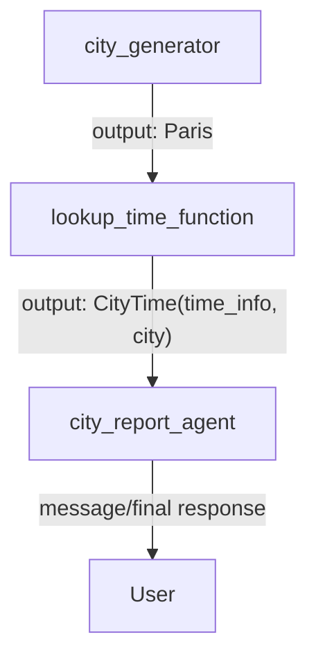

# Graph Data Handling trong ADK

## Tóm tắt

`Graph Data Handling` nói về cách dữ liệu di chuyển giữa các node trong graph workflow của ADK.

Nếu [[Graph Routes trong ADK]] trả lời câu hỏi:

```text
Workflow nên đi sang node nào tiếp theo?
```

thì `Graph Data Handling` trả lời câu hỏi:

```text
Dữ liệu được truyền giữa các node như thế nào?
Node sau nhận gì từ node trước?
Khi nào dùng output, message, state?
```

Ý chính: trong graph workflow, các node truyền dữ liệu cho nhau bằng `Event`.

## Event là trung tâm của data handling

Trong ADK graph workflow:

- Mỗi node nhận input từ node trước.
- Mỗi node emit `Event`.
- `Event` mang dữ liệu sang node tiếp theo, gửi message cho user, hoặc cập nhật state.

Ví dụ đơn giản:

```python
from google.adk import Event

def uppercase_node(node_input: str):
    output_value = node_input.upper()
    return Event(output=output_value)
```

Luồng:

```text
node trước output "hello"
-> uppercase_node nhận node_input = "hello"
-> return Event(output="HELLO")
-> node sau nhận "HELLO"
```

## Ba field quan trọng của Event

| Field | Dùng để làm gì? |
|---|---|
| `output` | Truyền dữ liệu cho node tiếp theo |
| `message` | Gửi thông tin/phản hồi cho user |
| `state` | Lưu dữ liệu nhỏ xuyên suốt session/workflow |

Ghi nhớ nhanh:

```text
output = cho node sau
message = cho user
state = cho workflow/session
```

## Event output

`Event(output=...)` là cách chuẩn để truyền data sang node kế tiếp.

Ví dụ:

```python
from google.adk import Event

def node_1():
    return Event(output="The Result")

def node_2(node_input: str):
    return Event(output=node_input.lower())
```

Luồng:

```text
node_1 -> "The Result"
node_2 nhận "The Result"
node_2 trả "the result"
```

Có thể truyền structured data:

```python
def lookup_city_time():
    return Event(
        output={
            "city_name": "Paris",
            "city_time": "10:10 AM",
        }
    )
```

Hoặc dùng Pydantic model để có schema rõ ràng hơn.

## Giới hạn của Event output

Docs lưu ý:

```text
Mỗi node chỉ được emit một Event.output payload trong một lần execution.
```

Nghĩa là có thể `yield` nhiều `Event`, nhưng không nên có nhiều `Event(output=...)` trong cùng một node execution.

Ví dụ nên tránh:

```python
def bad_node():
    yield Event(output="first")
    yield Event(output="second")  # có thể gây runtime error
```

Thiết kế tốt hơn:

```python
def good_node():
    return Event(
        output={
            "first": "first",
            "second": "second",
        }
    )
```

## Event message

`Event(message=...)` dùng cho dữ liệu muốn gửi tới user.

Ví dụ báo tiến trình:

```python
from google.adk import Event

async def user_message(node_input: str):
    yield Event(message="Beginning research process...")
```

Không nên dùng `message` để truyền dữ liệu nội bộ giữa các node.

Dùng đúng:

```text
message -> thông báo cho user
output  -> truyền cho node sau
```

Ví dụ:

```python
async def start_research(node_input: str):
    yield Event(message="Bắt đầu research...")
    return Event(output=node_input)
```

## Event state

`Event(state=...)` dùng để lưu dữ liệu nhỏ xuyên suốt workflow/session.

Ví dụ:

```python
from google.adk import Event

async def init_state_node(attempts: int = 0):
    yield Event(
        state={
            "attempts": attempts,
        },
    )

async def task_attempt_node(node_input, attempts: int):
    yield Event(
        state={
            "attempts": attempts + 1,
        },
    )

async def read_state_node(ctx):
    print(ctx.state)
```

Luồng:

```text
init_state_node set attempts = 0
task_attempt_node đọc attempts, tăng lên 1
read_state_node thấy attempts = 1
```

State phù hợp cho:

- số lần retry;
- flags;
- user preference nhỏ;
- trạng thái workflow;
- route context nhỏ;
- ID tạm;
- thông tin điều phối workflow.

Không dùng `state` để lưu dữ liệu lớn.

Docs khuyến nghị dữ liệu lớn nên dùng:

- artifacts;
- database;
- data persistence mechanism khác;
- tool chuyên lưu/đọc dữ liệu.

## return và yield

Nếu node chỉ cần trả một event đơn giản:

```python
return Event(output=value)
```

Nếu node cần emit nhiều event, ví dụ vừa báo user vừa tiếp tục xử lý:

```python
yield Event(message="Starting...")
yield Event(state={"step": "started"})
return Event(output=result)
```

Lưu ý:

```text
Nên chỉ có một Event(output=...) trong một node execution.
```

## input_schema và output_schema

ADK cho phép ép kiểu input/output giữa các node bằng schema.

Hai field quan trọng:

- `input_schema`: node/agent kỳ vọng input có shape gì.
- `output_schema`: node/agent phải trả output có shape gì.

Ví dụ:

```python
from pydantic import BaseModel
from datetime import date

class FlightSearchInput(BaseModel):
    origin: str
    destination: str
    departure_date: date
    passengers: int = 1

class FlightSearchOutput(BaseModel):
    flights: list
    cheapest_price: float
```

Gắn schema vào agent:

```python
from google.adk import Agent

flight_searcher = Agent(
    name="flight_searcher",
    instruction="Search for available flights.",
    input_schema=FlightSearchInput,
    output_schema=FlightSearchOutput,
    tools=[search_flights_api],
    mode="single_turn",
)
```

Lợi ích:

- Node sau biết chính xác node trước trả gì.
- Giảm lỗi do dữ liệu mơ hồ.
- Workflow dễ debug hơn.
- Agent instruction có thể reference field cụ thể.

## Structured data qua Pydantic model

Ví dụ workflow lấy tên city rồi lấy thời gian city.

```python
from pydantic import BaseModel
from google.adk import Event

class CityTime(BaseModel):
    time_info: str
    city: str

def lookup_time_function(city: str):
    return Event(
        output=CityTime(
            time_info="10:10 AM",
            city=city,
        )
    )
```

Node sau nhận object `CityTime`.

## Truy cập structured data trong instruction

Nếu agent nhận structured input, instruction có thể reference field bằng cú pháp `{Class.field}`.

Ví dụ:

```python
from google.adk import Agent

city_report_agent = Agent(
    name="city_report_agent",
    model="gemini-flash-latest",
    input_schema=CityTime,
    instruction="""
    Return a sentence in the following format:
    It is {CityTime.time_info} in {CityTime.city} right now.
    """,
)
```

Nếu input là:

```python
CityTime(time_info="10:10 AM", city="Paris")
```

Agent có thể tạo output:

```text
It is 10:10 AM in Paris right now.
```

## Chỉ rõ source node trong instruction

Khi workflow phức tạp, có thể có nhiều node cùng trả dữ liệu cùng schema. Khi đó nên chỉ rõ field lấy từ node nào.

Cú pháp:

```text
<Class.field from node_name>
```

Ví dụ:

```python
city_report_agent = Agent(
    name="city_report_agent",
    model="gemini-flash-latest",
    input_schema=CityTime,
    instruction="""
    Return a sentence in the following format:
    It is <CityTime.time_info from lookup_time_function> in
    <CityTime.city from lookup_time_function> right now.
    """,
)
```

Cách này chặt hơn `{CityTime.field}` vì nó chỉ rõ dữ liệu đến từ node `lookup_time_function`.

## Ví dụ workflow đầy đủ

```python
from google.adk import Agent, Workflow, Event
from pydantic import BaseModel

class CityTime(BaseModel):
    time_info: str
    city: str

def city_generator():
    return Event(output="Paris")

def lookup_time_function(city: str):
    return Event(
        output=CityTime(
            time_info="10:10 AM",
            city=city,
        )
    )

city_report_agent = Agent(
    name="city_report_agent",
    model="gemini-flash-latest",
    input_schema=CityTime,
    instruction="""
    Return a sentence in the following format:
    It is {CityTime.time_info} in {CityTime.city} right now.
    """,
)

root_agent = Workflow(
    name="root_agent",
    edges=[
        ("START", city_generator, lookup_time_function, city_report_agent)
    ],
)
```

Luồng dữ liệu:



Chi tiết:

```text
city_generator
-> output: "Paris"

lookup_time_function
-> input: "Paris"
-> output: CityTime(time_info="10:10 AM", city="Paris")

city_report_agent
-> input: CityTime(...)
-> output: "It is 10:10 AM in Paris right now."
```

## output vs message vs state

| Mục đích | Dùng field nào? | Ví dụ |
|---|---|---|
| Truyền dữ liệu sang node sau | `output` | CityTime object |
| Báo tiến trình cho user | `message` | "Beginning research process..." |
| Lưu biến nhỏ xuyên workflow | `state` | attempts, flags, route_context |

Sai lầm thường gặp:

- Dùng `message` để truyền dữ liệu nội bộ.
- Nhét dữ liệu lớn vào `state`.
- Emit nhiều `Event.output` trong một node.
- Không dùng schema nên node sau nhận data mơ hồ.

## Liên hệ với Graph Routes

Trong [[Graph Routes trong ADK]]:

```python
return Event(route="BUG")
```

dùng để chọn nhánh.

Trong data handling:

```python
return Event(output=data)
```

dùng để truyền data.

Có thể kết hợp:

```python
def router(node_input: str):
    if "bug" in node_input.lower():
        return Event(
            route="BUG",
            state={"ticket_type": "bug"},
        )
    return Event(
        route="SUPPORT",
        state={"ticket_type": "support"},
    )
```

Ở đây:

- `route` chọn nhánh.
- `state` lưu context nhỏ cho downstream nodes.

## Khi nào cần schema?

Nên dùng schema khi:

- Dữ liệu giữa các node có cấu trúc rõ.
- Node sau là agent cần field cụ thể.
- Workflow có nhiều node, dễ nhầm data.
- Muốn giảm lỗi runtime.
- Muốn instruction reference field bằng `{Class.field}`.

Không nhất thiết cần schema khi:

- Chỉ truyền string đơn giản.
- Workflow rất ngắn.
- Data không cần kiểm soát chặt.

## Ghi nhớ

Graph Data Handling trả lời câu hỏi:

```text
Dữ liệu chạy qua graph workflow như thế nào?
```

Các nguyên tắc chính:

- Dùng `Event(output=...)` để truyền dữ liệu cho node sau.
- Dùng `Event(message=...)` để gửi thông tin cho user.
- Dùng `Event(state=...)` để lưu state nhỏ trong session/workflow.
- Dùng `input_schema` và `output_schema` để ép kiểu dữ liệu.
- Dùng `{Class.field}` để reference structured input trong instruction.
- Dùng `<Class.field from node_name>` khi cần chỉ rõ source node.
- Không dùng `state` để lưu dữ liệu lớn.
- Không emit nhiều `Event.output` trong một node execution.

## Nguồn

- [Data handling for agent workflows](https://adk.dev/graphs/data-handling/)
- [Graph-based agent workflows](https://adk.dev/graphs/)
