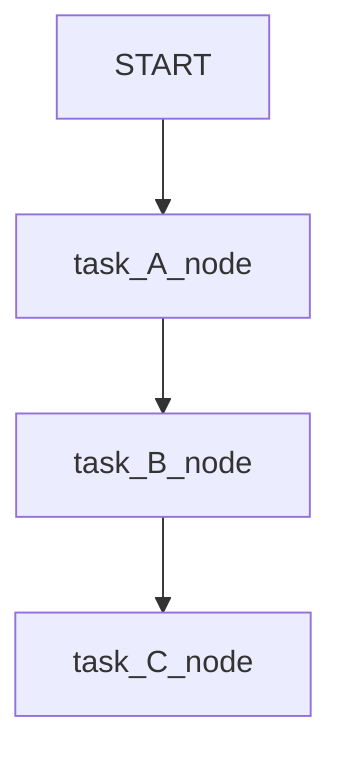
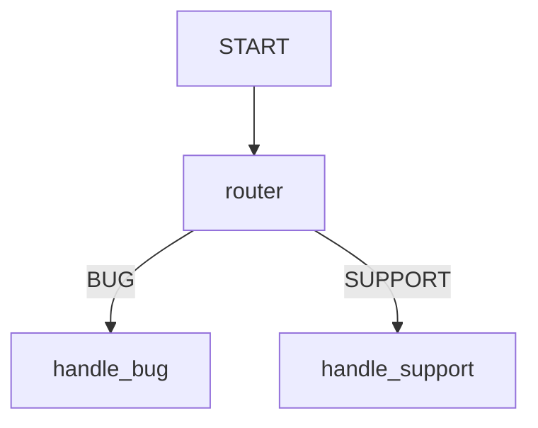
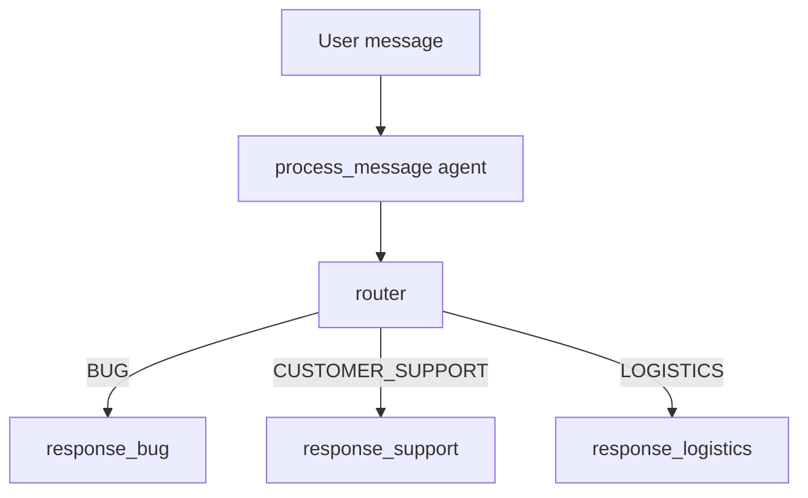
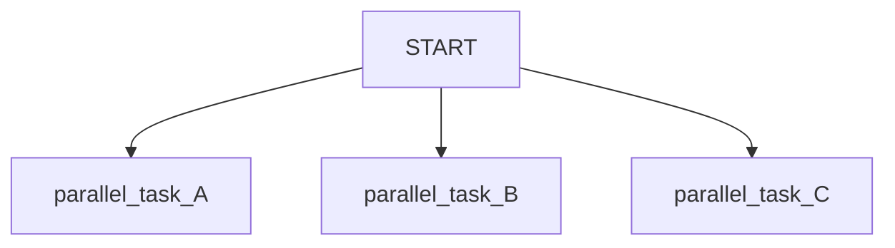
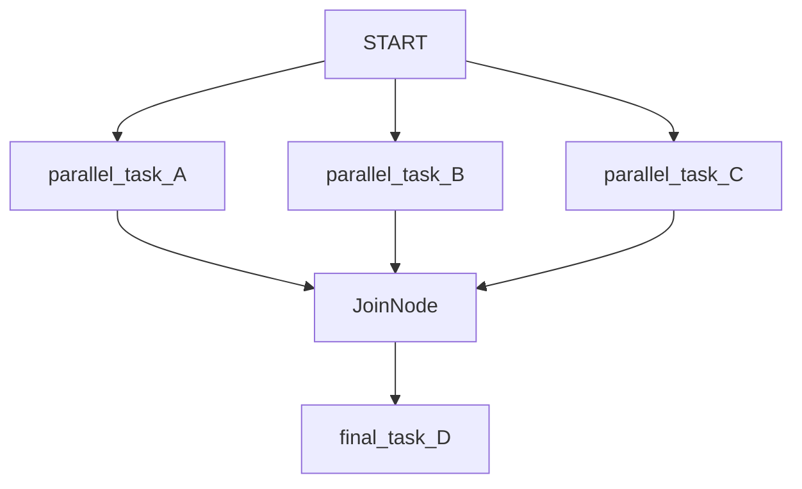
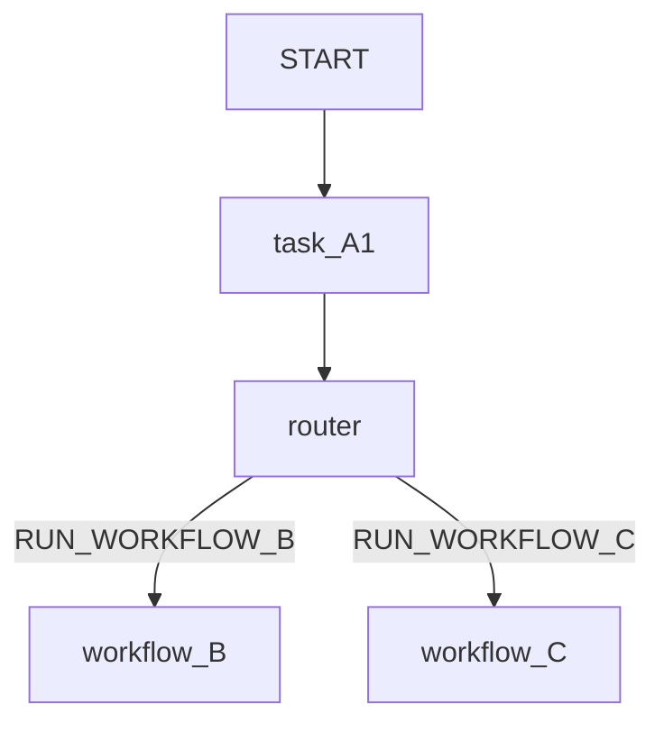

# Graph Routes trong ADK

## Tóm tắt

`Graph Routes` là cách xây workflow dạng graph trong ADK. Thay vì để một `LlmAgent` tự quyết toàn bộ bằng prompt, ta định nghĩa rõ:

- Node nào chạy trước.
- Node nào chạy sau.
- Khi nào rẽ nhánh.
- Khi nào chạy song song.
- Khi nào gom kết quả.
- Khi nào gọi workflow con.

Hiểu ngắn gọn:

```text
LlmAgent thường:
User -> Agent tự quyết bằng prompt

Graph workflow:
User -> Node A -> Node B -> Router -> Node C hoặc Node D -> Final
```

Graph workflow giúp tăng control, predictability và reliability cho workflow phức tạp.

## Graph-based workflow là gì?

Trong ADK, graph workflow dùng class `Workflow`.

Ví dụ đơn giản:

```python
from google.adk import Workflow

root_agent = Workflow(
    name="sequential_workflow",
    edges=[
        ("START", task_A_node, task_B_node, task_C_node),
    ],
)
```

Luồng chạy:

```text
START -> task_A_node -> task_B_node -> task_C_node
```

Ở đây workflow không phụ thuộc vào việc LLM tự nhớ quy trình trong instruction. Bạn định nghĩa quy trình bằng code.

## Khi nào dùng graph thay vì prompt?

Dùng prompt-based agent khi task đơn giản:

```text
User hỏi -> agent trả lời
```

Dùng graph-based workflow khi task có quy trình rõ:

```text
User gửi request
-> classify request
-> route theo loại request
-> chạy handler phù hợp
-> tổng hợp kết quả
-> trả response
```

Graph hữu ích khi:

- Quy trình có nhiều bước.
- Có điều kiện rẽ nhánh.
- Có nhiều node cần chạy song song.
- Cần gom output từ nhiều node.
- Cần kết hợp AI reasoning với code logic.
- Cần workflow ổn định hơn so với prompt dài.

## Node là gì?

Node là một bước xử lý trong graph.

Node có thể là:

- một `Agent`;
- một ADK `Tool`;
- một function Python;
- một human input task;
- một `Workflow` khác.

Ví dụ function node:

```python
from google.adk import Event

def uppercase_node(node_input: str):
    result = node_input.upper()
    return Event(output=result)
```

Node nhận input từ node trước, xử lý, rồi trả `Event`.

## Event là gì?

`Event` là object dùng để truyền dữ liệu hoặc điều hướng trong graph.

Trả output:

```python
return Event(output="Task completed")
```

Trả route:

```python
return Event(route="RUN_TASK_B")
```

Trả message:

```python
return Event(message="Workflow completed")
```

Các kiểu hay gặp:

| Event field | Ý nghĩa |
|---|---|
| `output` | Truyền dữ liệu cho node tiếp theo |
| `route` | Chọn nhánh cần chạy |
| `message` | Emit message cho workflow/user trace |

## edges là gì?

`edges` là danh sách khai báo đường đi trong graph.

Ví dụ chạy một node:

```python
edges=[
    ("START", task_A_node),
]
```

Ví dụ chạy nhiều node tuần tự:

```python
edges=[
    ("START", task_A_node, task_B_node, task_C_node),
]
```

Luồng:



`START` là keyword chỉ điểm bắt đầu của graph execution.

## Route branches và conditional execution

Đây là phần chính của `Graph Routes`.

Bạn tạo một node router. Router trả về `Event(route=...)`. Sau đó trong `edges`, map route value sang node cần chạy.

Ví dụ:

```python
from google.adk import Workflow, Event

def router(node_input: str):
    if "bug" in node_input.lower():
        return Event(route="BUG")
    return Event(route="SUPPORT")

def handle_bug(node_input: str):
    return Event(message="Handling bug...")

def handle_support(node_input: str):
    return Event(message="Handling support...")

root_agent = Workflow(
    name="routing_workflow",
    edges=[
        ("START", router),
        (
            router,
            {
                "BUG": handle_bug,
                "SUPPORT": handle_support,
            },
        ),
    ],
)
```

Luồng:



Nó giống `if/else`, nhưng được biểu diễn trong workflow graph.

## Ví dụ classify rồi route

Ví dụ một agent classify message trước, sau đó router function chọn nhánh.

```python
from google.adk import Agent, Workflow, Event

process_message = Agent(
    name="process_message",
    model="gemini-flash-latest",
    instruction="""
    Classify user message into either "BUG", "CUSTOMER_SUPPORT", or "LOGISTICS".
    If a message applies to more than one category, reply with a comma separated list.
    """,
    output_schema=str,
)

def router(node_input: str):
    routes = node_input.split(",")
    routes = [route.strip() for route in routes]
    return Event(route=routes)

def response_bug():
    return Event(message="Handling bug...")

def response_support():
    return Event(message="Handling customer support...")

def response_logistics():
    return Event(message="Handling logistics...")

root_agent = Workflow(
    name="routing_workflow",
    edges=[
        ("START", process_message, router),
        (
            router,
            {
                "BUG": response_bug,
                "CUSTOMER_SUPPORT": response_support,
                "LOGISTICS": response_logistics,
            },
        ),
    ],
)
```

Luồng:



Điểm hay: phần classify có thể dùng LLM, nhưng phần route là logic rõ ràng trong graph.

## Parallel tasks

Có thể dùng nhiều dòng `"START"` để chạy song song:

```python
edges=[
    ("START", parallel_task_A),
    ("START", parallel_task_B),
    ("START", parallel_task_C),
]
```

Luồng:



Cẩn thận: không phải node nào cũng nên hoặc có thể chạy song song. Đặc biệt không nên chạy nhiều interactive chat sessions trong cùng agent session.

## JoinNode là gì?

Khi chạy nhiều nhánh song song, thường cần gom output lại trước khi đi tiếp. Dùng `JoinNode`.

Ví dụ:

```python
from google.adk.workflow import JoinNode

my_join_node = JoinNode(name="my_join_node")

edges=[
    ("START", parallel_task_A, my_join_node),
    ("START", parallel_task_B, my_join_node),
    ("START", parallel_task_C, my_join_node),
    (my_join_node, final_task_D),
]
```

Luồng:



`JoinNode` chờ tất cả upstream nodes hoàn thành rồi mới chạy tiếp.

Lưu ý quan trọng:

```text
Nếu một upstream node không trả Event output, JoinNode có thể bị kẹt.
```

Vì vậy mỗi node đi vào JoinNode nên có failsafe output.

## Nested workflows

Workflow có thể nằm bên trong workflow khác.

Ví dụ:

```python
from google.adk import Workflow

root_agent = Workflow(
    name="parent_workflow",
    edges=[
        ("START", task_A1, router),
        (
            router,
            {
                "RUN_WORKFLOW_B": workflow_B,
                "RUN_WORKFLOW_C": workflow_C,
            },
        ),
    ],
)
```

Luồng:



Dùng nested workflow khi một nhánh xử lý phức tạp và bạn muốn đóng gói lại.

Ví dụ:

```text
parent_workflow
  -> classify_ticket
  -> route
      -> bug_workflow
      -> billing_workflow
      -> logistics_workflow
```

## So sánh Graph Routes với Agent Team

| Cách làm | Routing dựa vào gì? | Ai quyết định? | Khi nào dùng? |
|---|---|---|---|
| `sub_agents` trong Agent Team | Prompt, instruction, description | LLM của root agent | Routing mềm, hội thoại tự nhiên |
| `AgentTool` | Tool calling của root agent | LLM của root agent | Root gọi agent khác rồi tổng hợp |
| `Graph Routes` | `Event(route=...)` và `edges` map | Code/workflow graph | Quy trình cần kiểm soát rõ |

Ví dụ:

```text
Agent Team:
root_agent đọc request -> LLM quyết định delegate greeting_agent hay farewell_agent

Graph Routes:
router function trả Event(route="BUG") -> graph chạy handle_bug
```

Graph Routes đáng tin hơn khi workflow có rule/process rõ ràng.

## So sánh Graph Routes với SequentialAgent

`SequentialAgent` phù hợp khi chỉ cần chạy các agent theo thứ tự cố định:

```text
A -> B -> C
```

Graph workflow linh hoạt hơn vì hỗ trợ:

- tuần tự;
- rẽ nhánh;
- song song;
- join;
- workflow lồng nhau.

Nếu chỉ cần chạy từng bước cố định, `SequentialAgent` có thể đủ. Nếu cần route/branch phức tạp, dùng graph.

## Cẩn trọng khi dùng Agents trong graph

Docs lưu ý rằng có thể thêm `Agent` hoặc `LlmAgent` vào graph workflow, nhưng agent phải ở task hoặc single-turn mode.

Ý nghĩa thực tế:

- Graph workflow phù hợp với step-based execution.
- Không nên dùng graph để chạy nhiều interactive chat session lồng nhau trong cùng session.
- Node agent trong graph nên xử lý một task rõ ràng rồi trả output.

## Khi nào nên dùng Graph Routes?

Nên dùng khi:

- Có business process rõ.
- Có nhiều loại request cần route.
- Cần audit/trace từng bước.
- Cần kết hợp LLM với deterministic code.
- Cần chạy nhiều nhánh song song.
- Cần workflow ổn định hơn prompt-based agent.

Ví dụ:

```text
Customer ticket workflow:
1. Classify ticket.
2. Route sang BUG, BILLING, LOGISTICS.
3. Chạy workflow con tương ứng.
4. Gom hoặc trả kết quả.
```

```text
Research workflow:
1. Generate research questions.
2. Run 3 search tasks song song.
3. Join results.
4. Summarize final answer.
```

## Khi nào không cần Graph Routes?

Không cần khi:

- Agent chỉ trả lời câu hỏi đơn giản.
- Workflow chỉ có một bước.
- Routing không quan trọng.
- Prompt + tools đã đủ ổn.
- Task có tính hội thoại mở, không theo process cố định.

## Ghi nhớ

Graph Routes trả lời câu hỏi:

```text
Workflow nên đi sang node nào tiếp theo?
```

Các khái niệm chính:

```text
Workflow = toàn bộ graph
Node = một bước xử lý
edges = đường đi giữa các node
START = điểm bắt đầu
Event(output=...) = truyền dữ liệu
Event(route=...) = chọn nhánh
JoinNode = gom các nhánh song song
Nested Workflow = workflow con bên trong workflow cha
```

Nguyên tắc thiết kế:

- Dùng LLM agent cho phần cần reasoning/ngôn ngữ tự nhiên.
- Dùng function node cho logic deterministic.
- Dùng router node để rẽ nhánh rõ ràng.
- Dùng JoinNode khi cần gom kết quả song song.
- Dùng nested workflow để đóng gói nhánh phức tạp.

## Nguồn

- [Build graph routes for agent workflows](https://adk.dev/graphs/routes/)
- [Graph-based agent workflows](https://adk.dev/graphs/)
