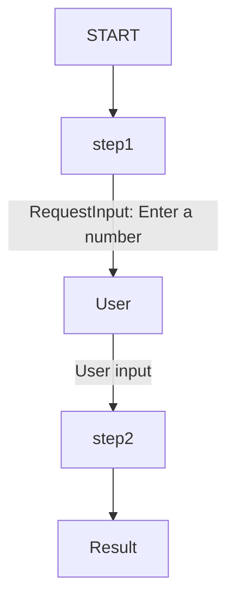
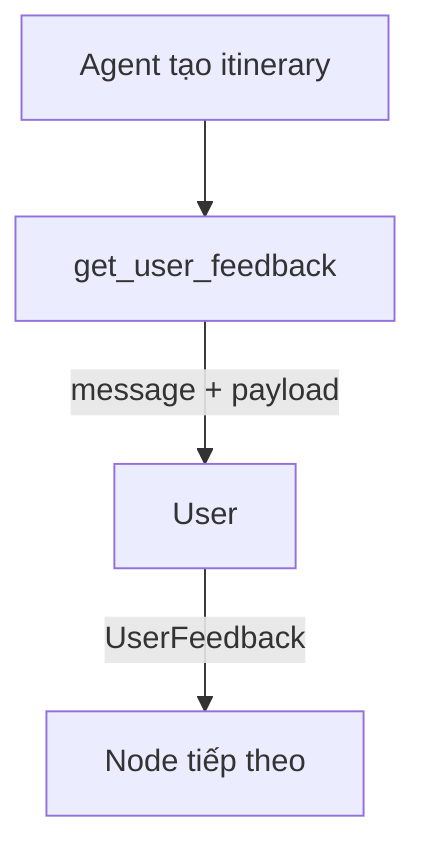
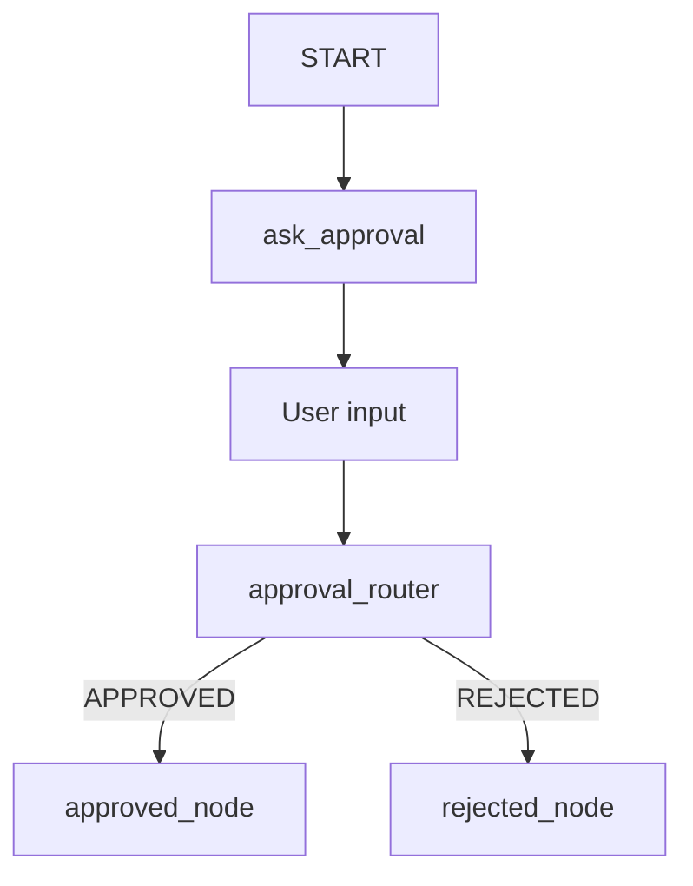

# Human Input trong Graph Workflow ADK

> Hub: [[Build Agents]]

## Tóm tắt

`Human Input` trong graph workflow là cách thêm bước hỏi người dùng vào workflow.

Workflow có thể:

- chạy đến một node;
- hỏi user nhập dữ liệu hoặc xác nhận;
- tạm dừng;
- đợi user trả lời;
- lấy câu trả lời đó truyền sang node tiếp theo.

Hiểu ngắn gọn:

```text
Workflow đang chạy
-> tới human input node
-> hỏi user
-> pause workflow
-> user nhập câu trả lời
-> workflow tiếp tục
```

Trong ADK, human input node dùng `RequestInput`.

## RequestInput là gì?

`RequestInput` là event đặc biệt dùng để yêu cầu input từ người dùng trong graph workflow.

Ví dụ từ docs:

```python
from google.adk.events import RequestInput
from google.adk import Workflow

def step1():
    yield RequestInput(message="Enter a number:")

def step2(node_input):
    return node_input * 2

root_agent = Workflow(
    name="root_agent",
    edges=[("START", step1, step2)],
)
```

Luồng:



Chi tiết:

```text
START
-> step1 yêu cầu user nhập số
-> workflow pause
-> user nhập giá trị
-> giá trị đó được truyền sang step2
-> step2 xử lý tiếp
```

## Vì sao dùng yield mà không phải return?

Docs dùng:

```python
def step1():
    yield RequestInput(message="Enter a number:")
```

Không dùng:

```python
def step1():
    return RequestInput(message="Enter a number:")
```

Lý do thực dụng:

`RequestInput` là một event cần được emit ra runtime/UI để workflow tạm dừng và chờ user phản hồi.

`yield` cho phép node phát event ra ngoài trong quá trình chạy:

```text
step1 phát RequestInput
-> runtime/UI nhận event
-> hiển thị prompt cho user
-> workflow pause
-> user nhập response
-> workflow resume
```

Trong khi `return` thường mang nghĩa node trả kết quả cuối rồi kết thúc function.

## yield trong graph workflow

`yield` biến function thành generator, cho phép node emit nhiều event theo thứ tự.

Ví dụ:

```python
from google.adk import Event
from google.adk.events import RequestInput

async def step1():
    yield Event(message="Chuẩn bị hỏi user...")
    yield RequestInput(message="Enter a number:")
```

Luồng:

```text
1. Gửi message cho user: "Chuẩn bị hỏi user..."
2. Gửi RequestInput để hỏi user
3. Workflow pause chờ user input
```

Nếu dùng `return`, node chỉ trả được một object và kết thúc ngay.

Ghi nhớ:

```text
return Event(output=...)      -> trả output cho node sau
yield Event(message=...)      -> emit message cho user
yield RequestInput(...)       -> hỏi user và pause workflow
```

## RequestInput khác gì Event(message)?

Trong [[Graph Data Handling trong ADK]], `Event(message=...)` chỉ gửi thông báo cho user.

Ví dụ:

```python
yield Event(message="Beginning research process...")
```

Nó không yêu cầu user trả lời.

`RequestInput` thì khác:

```python
yield RequestInput(message="Enter a number:")
```

Nó yêu cầu user nhập dữ liệu và workflow tạm dừng để chờ input.

So sánh:

| Cách dùng | Ý nghĩa | Workflow có pause không? |
|---|---|---:|
| `Event(message=...)` | Gửi thông báo cho user | Không |
| `RequestInput(...)` | Hỏi user và chờ phản hồi | Có |
| `Event(output=...)` | Truyền dữ liệu cho node sau | Không |
| `Event(state=...)` | Cập nhật state workflow/session | Không |

## Configuration options

`RequestInput` có các option chính:

```python
RequestInput(
    message=...,
    payload=...,
    response_schema=...,
)
```

Ý nghĩa:

| Option | Ý nghĩa |
|---|---|
| `message` | Text hiển thị cho user, giải thích cần nhập gì |
| `payload` | Dữ liệu có cấu trúc gửi kèm request |
| `response_schema` | Schema mà response của user phải tuân theo |

## Request input với text đơn giản

Ví dụ hỏi user nhập thông tin itinerary:

```python
from google.adk.events import RequestInput

async def initial_prompt(ctx):
    input_message = """
    Đây là workflow tạo itinerary.
    Hãy nhập thông tin:
    - City (bắt buộc)
    - Age
    - Hobby
    - Ví dụ attraction bạn từng thích
    """

    yield RequestInput(
        message=input_message,
        response_schema=str,
    )
```

Luồng:

```text
initial_prompt
-> hiển thị message
-> chờ user nhập text
-> text được truyền tiếp trong workflow
```

## Request input với payload

`payload` dùng khi muốn gửi dữ liệu hiện có cho user xem trước khi họ phản hồi.

Ví dụ agent trước tạo danh sách hoạt động:

```python
from pydantic import BaseModel
from typing import List, Dict

class ActivitiesList(BaseModel):
    itinerary: List[Dict[str, str]]

class UserFeedback(BaseModel):
    user_response: str
```

Node hỏi feedback:

```python
from google.adk.events import RequestInput

async def get_user_feedback(node_input: ActivitiesList):
    message = f"""
    Đây là itinerary đề xuất:

    {node_input}

    Bạn thích mục nào? Muốn thay đổi gì không?
    """

    yield RequestInput(
        message=message,
        payload=node_input,
        response_schema=UserFeedback,
    )
```

Luồng:



Ở đây:

- `message`: câu hỏi hiển thị cho user.
- `payload`: itinerary hiện tại.
- `response_schema`: format feedback mong đợi.

## Lưu ý về response_schema

Docs nhấn mạnh:

```text
RequestInput không tự reformat human response để khớp schema.
```

Nghĩa là nếu khai báo:

```python
class UserFeedback(BaseModel):
    user_response: str
```

thì response từ user/app phải có format phù hợp với schema đó.

Nếu user nhập text tự do, `RequestInput` không tự biến nó thành object đúng schema.

Để UX tốt hơn, có hai cách:

```text
Cách 1:
UI form thu structured input đúng schema.

Cách 2:
User nhập tự do -> Agent node chuẩn hóa thành schema.
```

## Khi nào dùng Human Input node?

Dùng khi workflow cần:

- user nhập thêm dữ liệu;
- user xác nhận trước khi hành động;
- user chọn option;
- user review kết quả agent tạo ra;
- human approval trước thao tác nhạy cảm;
- user feedback để lặp hoặc chỉnh workflow.

Ví dụ:

```text
Travel itinerary workflow:
1. Agent tạo itinerary ban đầu.
2. RequestInput hỏi user thích/muốn đổi gì.
3. Agent chỉnh itinerary theo feedback.
```

```text
Approval workflow:
1. Agent chuẩn bị action.
2. RequestInput hỏi user xác nhận.
3. Nếu user approve, workflow chạy tiếp.
4. Nếu user reject, workflow dừng hoặc route sang nhánh sửa.
```

## Kết hợp với Graph Routes

Human input thường kết hợp với routing.

Ví dụ:

```python
from google.adk import Event
from google.adk.events import RequestInput

async def ask_approval():
    yield RequestInput(
        message="Bạn có muốn tiếp tục không? Nhập approve hoặc reject.",
        response_schema=str,
    )

def approval_router(node_input: str):
    if node_input.lower() == "approve":
        return Event(route="APPROVED")
    return Event(route="REJECTED")
```

Workflow:

```python
root_agent = Workflow(
    name="approval_workflow",
    edges=[
        ("START", ask_approval, approval_router),
        (
            approval_router,
            {
                "APPROVED": approved_node,
                "REJECTED": rejected_node,
            },
        ),
    ],
)
```

Luồng:



## Kết hợp với Data Handling

Human input node cũng là một phần của data flow.

```text
RequestInput response
-> trở thành node_input cho node tiếp theo
```

Nếu user response là structured data, node sau có thể nhận schema tương ứng.

Ví dụ:

```python
class UserChoice(BaseModel):
    action: str
    reason: str

async def ask_choice():
    yield RequestInput(
        message="Chọn action và nêu lý do.",
        response_schema=UserChoice,
    )

def handle_choice(node_input: UserChoice):
    return Event(
        output=f"User chose {node_input.action}: {node_input.reason}"
    )
```

## Sai lầm thường gặp

- Dùng `Event(message=...)` để hỏi user, nhưng workflow không pause.
- Dùng `return RequestInput(...)` thay vì `yield RequestInput(...)`.
- Khai báo `response_schema` nhưng UI/user không trả đúng schema.
- Dùng human input cho việc agent có thể tự xử lý mà không cần người.
- Không route rõ sau khi user approve/reject.

## Ghi nhớ

Human Input trong graph workflow trả lời câu hỏi:

```text
Làm sao tạm dừng workflow để hỏi người dùng?
```

Các điểm chính:

- Dùng `RequestInput` để hỏi user.
- Dùng `yield RequestInput(...)` để emit request và pause workflow.
- `message` là text hỏi user.
- `payload` là dữ liệu gửi kèm cho user xem.
- `response_schema` là format mong đợi của câu trả lời.
- `RequestInput` không tự sửa response cho khớp schema.
- Response của user trở thành input cho node tiếp theo.

## Nguồn

- [Human input for agent workflows](https://adk.dev/graphs/human-input/)
