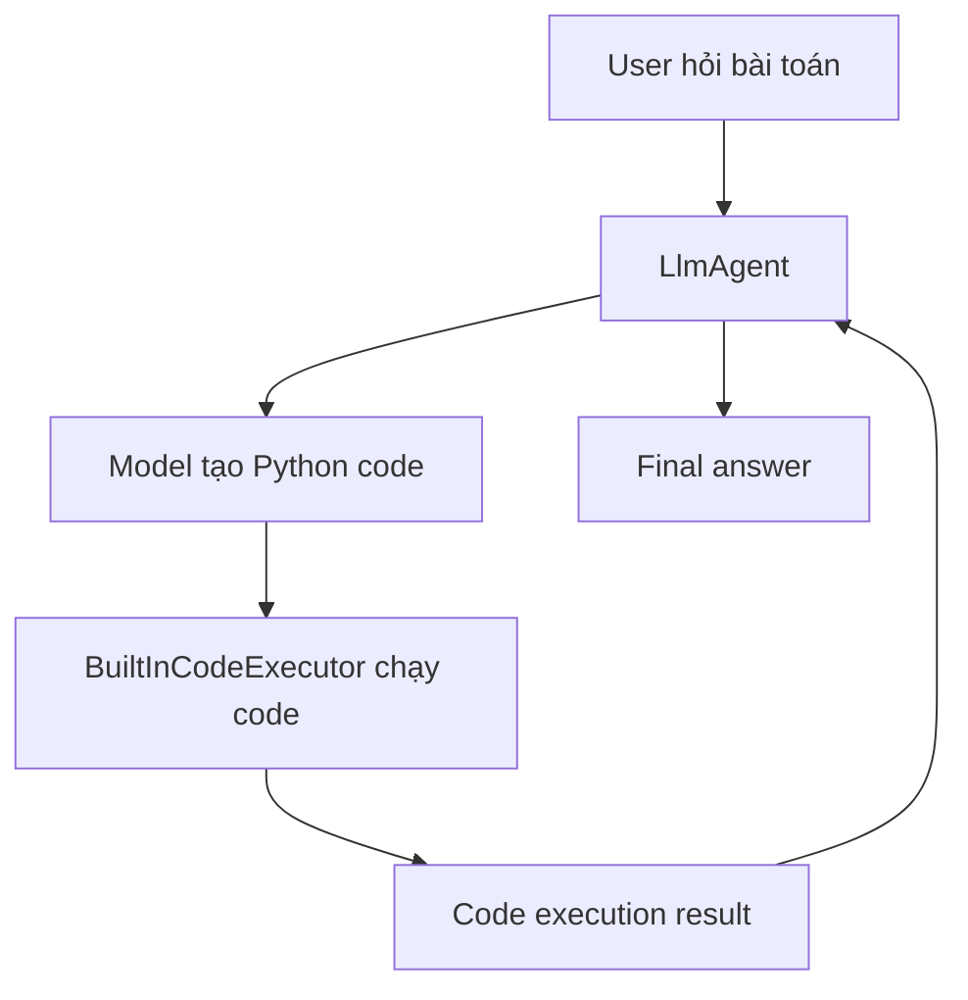
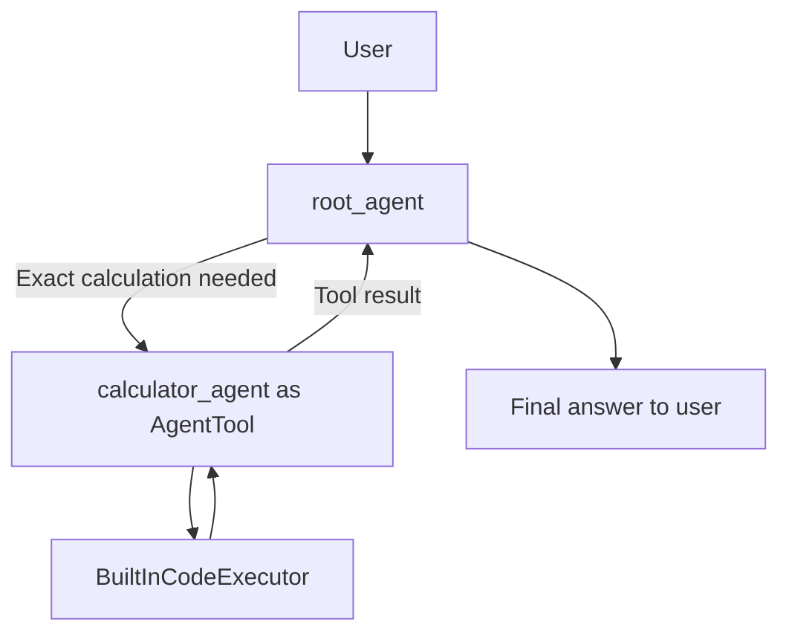

# Planner và BuiltInCodeExecutor trong LlmAgent

## Tóm tắt

`planner` và `BuiltInCodeExecutor` đều làm `LlmAgent` mạnh hơn, nhưng chúng nằm ở hai tầng khác nhau.

- `planner`: giúp agent lập kế hoạch xử lý.
- `BuiltInCodeExecutor`: cho agent chạy code thật, thường là Python code do model tạo ra.

Hiểu ngắn gọn:

```text
planner = bộ não lập kế hoạch
BuiltInCodeExecutor = tay chạy code
```

## Planner là gì?

`planner` giúp agent trả lời câu hỏi:

```text
Nên làm những bước nào?
Có cần gọi tool không?
Gọi tool nào trước, tool nào sau?
Sau khi có kết quả thì tổng hợp thế nào?
```

Planner không tự chạy code và không tự gọi API. Nó giúp LLM có cấu trúc suy luận tốt hơn khi xử lý task nhiều bước.

Ví dụ user hỏi:

```text
Nếu trời đang mưa ở New York thì nhiệt độ hiện tại là bao nhiêu?
```

Agent có tools:

```python
get_weather(city)
get_current_time(city)
```

Nếu có planner, agent có thể đi theo hướng:

```text
1. Kiểm tra thời tiết New York bằng get_weather.
2. Nếu kết quả có mưa, lấy nhiệt độ từ weather report.
3. Trả lời user.
```

## Các loại planner trong ADK

ADK docs nói đến hai planner chính:

- `BuiltInPlanner`
- `PlanReActPlanner`

### BuiltInPlanner

`BuiltInPlanner` dùng khả năng thinking/planning built-in của model, ví dụ Gemini thinking.

Ví dụ:

```python
from google.adk.agents import Agent
from google.adk.planners import BuiltInPlanner
from google.genai import types

agent = Agent(
    name="weather_agent",
    model="gemini-flash-latest",
    planner=BuiltInPlanner(
        thinking_config=types.ThinkingConfig(
            thinking_budget=1024,
            include_thoughts=False,
        )
    ),
    tools=[get_weather],
)
```

Các tham số đáng chú ý:

- `thinking_budget`: ngân sách token cho phần thinking.
- `include_thoughts`: có include raw thoughts hay không.

Trong app thật, thường không nên expose raw thoughts cho user. Dùng `include_thoughts=False` là mặc định an toàn hơn cho output.

### PlanReActPlanner

`PlanReActPlanner` hướng model theo format kiểu:

```text
PLAN -> ACTION -> REASONING -> FINAL_ANSWER
```

Ví dụ:

```python
from google.adk.agents import Agent
from google.adk.planners import PlanReActPlanner

agent = Agent(
    name="research_agent",
    model="gemini-flash-latest",
    planner=PlanReActPlanner(),
    tools=[google_search],
)
```

Dùng khi muốn agent xử lý task nhiều bước theo quy trình rõ hơn, đặc biệt với agent có nhiều tools.

## Khi nào nên dùng planner?

Nên dùng planner khi task:

- Cần nhiều bước.
- Cần gọi nhiều tools.
- Cần research rồi tổng hợp.
- Cần suy luận trước khi hành động.
- Dễ sai nếu agent trả lời ngay.

Ví dụ phù hợp:

```text
Tìm tin AI mới nhất, lọc 3 tin quan trọng, rồi tóm tắt bằng tiếng Việt.
```

```text
Phân tích yêu cầu này, xác định cần gọi tool nào, rồi đưa ra kế hoạch triển khai.
```

Không nhất thiết dùng planner khi task rất đơn giản:

```text
Chào user.
Trả lời FAQ ngắn.
Format lại một đoạn text.
```

## BuiltInCodeExecutor là gì?

`BuiltInCodeExecutor` cho agent khả năng chạy code thật.

Nó trả lời câu hỏi:

```text
Nếu agent cần tính toán hoặc xử lý dữ liệu bằng code, ai sẽ chạy code đó?
```

Luồng cơ bản:



Ví dụ user hỏi:

```text
Calculate the value of (5 + 7) * 3
```

Agent có thể tạo code nội bộ:

```python
print((5 + 7) * 3)
```

`BuiltInCodeExecutor` chạy code và trả kết quả:

```text
36
```

Agent trả final answer:

```text
36
```

## Ví dụ BuiltInCodeExecutor

```python
from google.adk.agents import LlmAgent
from google.adk.code_executors import BuiltInCodeExecutor

code_agent = LlmAgent(
    name="calculator_agent",
    model="gemini-2.0-flash",
    code_executor=BuiltInCodeExecutor(),
    instruction="""
    You are a calculator agent.
    When given a mathematical expression, write and execute Python code to calculate the result.
    Return only the final numerical result.
    """,
)
```

Điểm chính:

- Model sinh code.
- `BuiltInCodeExecutor` chạy code.
- Kết quả chạy code quay lại agent.
- Agent dùng kết quả đó để trả lời user.

## Khi nào nên dùng BuiltInCodeExecutor?

Nên dùng khi task cần tính toán hoặc xử lý dữ liệu chính xác hơn việc LLM tự nhẩm:

- Tính toán số học.
- Thống kê.
- Xử lý list/dict nhỏ.
- Sort/filter dữ liệu.
- Tính factorial, compound interest, trung bình, tỷ lệ.
- Kiểm tra logic bằng code.

Ví dụ phù hợp:

```text
Tính lợi nhuận trung bình từ danh sách số này.
```

```text
Sort list này rồi lấy top 5.
```

```text
Tính 10 factorial.
```

Không nên dùng cho:

- Trả lời kiến thức thông thường.
- Chào hỏi.
- Viết văn bản đơn giản.
- Task không cần chạy code.

## So sánh planner và BuiltInCodeExecutor

| Thành phần | Vai trò | Có chạy code không? | Dùng khi nào? |
|---|---|---:|---|
| `planner` | Lập kế hoạch xử lý | Không | Task nhiều bước, nhiều tool, cần reasoning |
| `BuiltInPlanner` | Dùng planning/thinking built-in của model | Không | Muốn model suy luận có ngân sách thinking |
| `PlanReActPlanner` | Ép model đi theo plan/action/reasoning | Không | Muốn flow ReAct rõ ràng |
| `BuiltInCodeExecutor` | Chạy code do model tạo | Có | Tính toán, xử lý dữ liệu, chạy script nhỏ |

## Có dùng chung planner và code executor không?

Về mặt ý tưởng, có thể hiểu như sau:

```text
planner quyết định: "Bài này cần tính toán bằng code."
BuiltInCodeExecutor thực hiện: chạy code để tính toán.
```

Tuy nhiên, ADK docs có lưu ý về giới hạn của built-in code execution: tool này thường chỉ nên dùng một mình trong một agent instance.

Vì vậy kiến trúc sạch hơn là tách agent chuyên chạy code.

## Kiến trúc khuyến nghị

Thay vì nhét code execution vào root agent có nhiều tools, tạo một `calculator_agent` riêng:

```python
from google.adk.agents import LlmAgent
from google.adk.code_executors import BuiltInCodeExecutor
from google.adk.tools.agent_tool import AgentTool

calculator_agent = LlmAgent(
    name="calculator_agent",
    model="gemini-2.0-flash",
    code_executor=BuiltInCodeExecutor(),
    instruction="""
    Use Python code to calculate accurately.
    Return only the final result and a short explanation if needed.
    """,
)

root_agent = LlmAgent(
    name="root_agent",
    model="gemini-flash-latest",
    instruction="""
    You are the main assistant.
    If exact calculation is needed, call calculator_agent.
    After receiving the result, explain it clearly to the user.
    """,
    tools=[
        AgentTool(agent=calculator_agent),
    ],
)
```

Luồng:



Lợi ích:

- Root agent vẫn giữ vai trò tổng hợp.
- Calculator agent chỉ tập trung chạy code/tính toán.
- Tránh làm một agent có quá nhiều capability lẫn lộn.
- Dễ test và debug hơn.

## Ví dụ planner và code executor khác nhau thế nào

User hỏi:

```text
Tìm 3 cổ phiếu tăng mạnh nhất trong danh sách này, tính tăng trưởng trung bình, rồi giải thích kết quả.
```

Một thiết kế tốt:

```text
root_agent có planner
  -> lập kế hoạch: parse data, tính toán, giải thích
  -> gọi calculator_agent nếu cần tính toán
calculator_agent có BuiltInCodeExecutor
  -> chạy code tính toán
  -> trả result về root_agent
root_agent
  -> tổng hợp và giải thích cho user
```

Ở đây:

- Planner giúp root agent biết nên làm gì trước/sau.
- Code executor giúp calculator agent tính đúng.

## Ghi nhớ

`planner` không phải tool chạy code. Nó là cơ chế giúp agent suy luận theo bước.

`BuiltInCodeExecutor` không phải planner. Nó là cơ chế chạy code do model tạo ra.

Nếu task cần suy luận nhiều bước, dùng planner.

Nếu task cần tính toán/chạy script, dùng `BuiltInCodeExecutor`.

Nếu task vừa cần lập kế hoạch vừa cần chạy code, nên tách thành nhiều agent:

```text
root_agent có planner
calculator_agent có BuiltInCodeExecutor
root_agent gọi calculator_agent bằng AgentTool
```

## Nguồn

- [Simple agents with LlmAgent](https://adk.dev/agents/llm-agents/)
- [Gemini API Code Execution tool for ADK](https://adk.dev/integrations/code-execution/)
